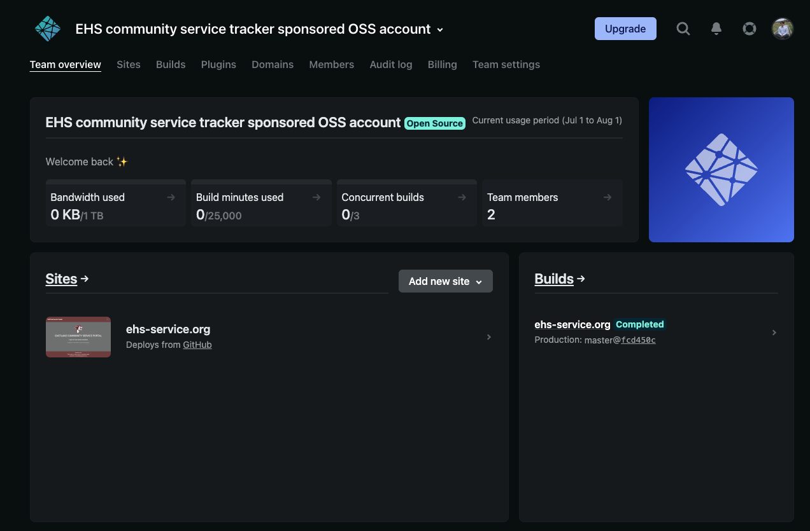

<h1 align="center">Community Service Tracker</h1>

                
  
  
  
  

   Repo for the eastlake community service tracker website 
   <a href="https://ehs-service.org">ehs-service.org</a>

   

# Contributing 
Please see [CONTRIBUTING.md](./CONTRIBUTING.md) for how to run the website locally

# Netlify
Thanks to Netlify for providing static hosting through their open source sponsorship program. 
We are able to add unlimited collaborator and have all the "pro" plan features enabled.

   

